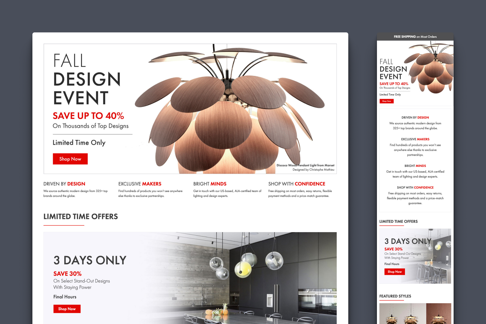
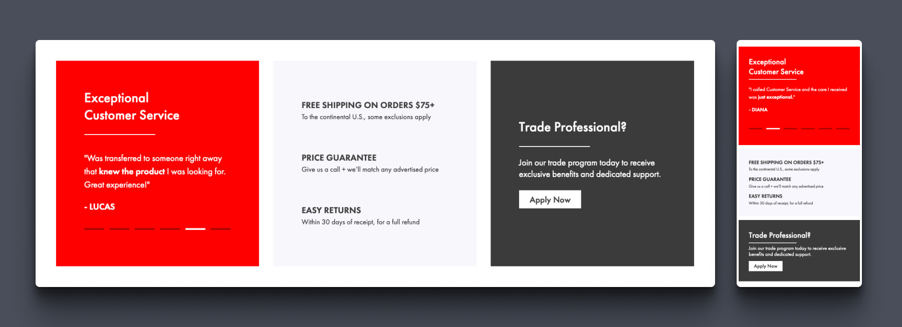

When the YDesign Group team and myself set out to redesign the YLighting homepage, it became apparent early on that we had a much larger opportunity. What started as a design refresh, quickly evolved into a broader system that could be used to unify our marketing efforts across the site. Not only would we seek to boost the marketing performance of the homepage, we would use the homepage as a starting point to create a series of modular components, guided by brand standards that would be developed in parallel.

## The Design Phase

Before any design work could begin, the team took the time to build a matrix of business and hypothesized user goals. This enabled us to identify potential elements and keep our design aligned with our priorities as the process got more complex. From there, I produced a series of wireframes that were whittled down into a primary candidate.

There were several key opportunities that guided the early design process. First, the current homepage structure was very inefficient from an operational perspective, needing constant design support as assets moved up and down the page or required updates to end-date messaging. Because the size, shape, and text for all assets was heavily context dependent, it was also difficult to reuse them in other templates or marketing channels.

The second opportunity we identified was presenting more of YLighting's own brand story, values, and differentiators. The homepage was often ripe with content about sales happening now, but relatively light on content that spoke to the brand itself, and why a user could feel confident they'd found the right place to shop for high-end modern lighting.

### Hi-Fidelity Mockups

I produced several versions of the homepage before the team landed on a design that we felt accomplished our goals. We would add a space just below the hero banner to reinforce YLighting's brand pillars, provide a prominent category navigation to help user's find what they need quickly, and create a dedicated section for inspirational content. Confidence builders, like customer reviews and key policies, would receive a dedicated home. Lastly, we would make the page a wider 1440px on desktop, creating room for a much more spacious and contemporary layout.

## Development

This homepage redesign was the first deliverable developed as part of another project I was the lead on, YLighting's [Marketing Design System](/portfolio/marketing-design-system/). With a system in place, many of the low-level development had already been done, allowing me to focus on adding functionality specific to the homepage.

For example, in the component we would call the 'customer validation section,' I was able to add a carousel of customer feedback. While I'm not a fan of carousels in general, I thought this was the perfect use case for it. General customer reviews are not information that every customer is looking for, but, for those that are, it's nice to be able to provide extra context without interfering with the experience of other users.

Another advantage of owning the design and implementation is that I was able to create components that could be reused in other templates. This small optimization can be a significant time-saver when a sale, or campaign needs to be represented in several locations around the site.

## AB Testing + Results

Being such a large change, this homepage update was published over time as a series of AB tests. This was to better understand the effects of some our design and strategy decisions, as well as to make sure that we weren't adversely affecting any success metrics.

### Testing Look and Feel

Our first test was very early in the process, and was designed to assess the general aesthetic of our new design. This design represented a complete evolution from our historical homepage. The design was much wider, with much larger imagery, and it utilized more negative space, typography, and layout to create hierarchy.

Our tests demonstrated a very clear uptick in user engagement with the new homepage design (% of homepage visitors that engaged with a piece of homepage content). We saw an average lift of 62% on desktop and 38% on mobile, which made sense given that our desktop experience represented a much larger shift in design. With such a clear difference, we made the decision to fully switch to the new aesthetic going forward.

### Testing a New Strategy

Our historical homepage strategy required many interlocking homepage configurations, with categories, brands or sales coming up and down almost daily. This created a lot of extra work, and a potential for errors, that we suspected was unnecessary. We had alo formed a hypothesis that our customer's goals weren't primarily sale-oriented.

For this test, we compared our newly refreshed homepage aesthetic, with a version that folded in our new homepage strategy. The variation would deemphasize sale messaging, making the homepage more evergreen and easier to maintain, and add all of the new components we had created as part of this redesign. For the hero, we would also lead with a brand statement, instead of a sale message.

Despite similar performance, we ultimately saw a small drop in revenue per customer with our new homepage design. On further analysis, we realized that our non-sale hero accounted for a massive drop in engagement between the two versions, while the more evergreen messaging performed quite well as a user moved down the page.

### Finding a Winner

Ultimately, we hypothesized that sale messaging may not be a user's primary goal overall, but it is an important pattern for the homepage hero. In a new test, we restored the primary sale message to the hero position (we used the same sale message in our control and variation), and made some iterative design improvements throughout the page.

While we elected to not run this test long enough to reach full statistical significance, we found that the new design was performing slightly better than our control. This test had run for a full month, and had been served to well over 50K+ visitors. Given that the new design represented major improvements to our efficiency and processes as a team, it became clear that we had found our winner, and a new baseline for future iterations was established.

