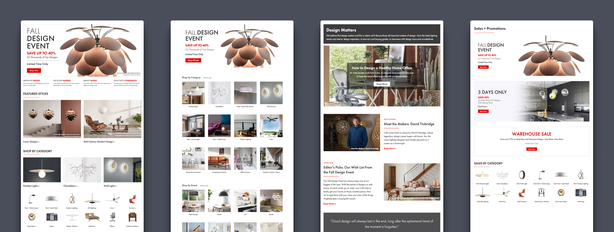
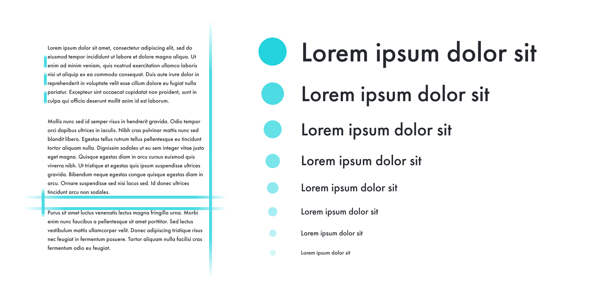

As a small team, serving two e-commerce brands, YDesign Group's designers produce an impressive amount of deliverables on a daily basis. Any given week can be overflowing with homepages, marketing emails, landing pages, online marketing assets, inspirational articles, and more. In addition to these day-to-day duties, the team manages to support many long term projects, including new templates, UI and UX projects, and others. While attainable on an average week, producing work at a high volume across a team of designers, presented challenges for consistency, efficiency, and flexibility.

An asset might be created for a homepage by one designer and then remade for an email or landing page by a different designer. This generated unnecessary rework and made it harder to achieve consistency across deliverables. Often, multiple new templates would be developed in parallel, employing different patterns and markup. Eventually, we found ourselves in a situation where many templates were bespoke, with no possible code reuse between them.

To remedy these issues, we set out to create a system of reusable marketing components, informed by a series of carefully considered design decisions. Further, these components would share design specifications with our other channels, enabling us to reuse more of our work and onboard new, or freelance designers faster. This design system would be part of a multi-pronged approach, involving a brand refresh, new brand standards, and a system that would pull both together into a toolkit for YLighting's marketing designers.

## Design

As the front door to our site experience, the homepage was identified as the perfect starting point for this project. Through that design process, I was able to establish a grid, typography system, standardized spacing values, and a series of baseline components that could be reused for other templates.

### Typography

To establish a more consistent vertical rhythm, and improve the overall consistency of our templates, I created a standardized type system that would inform all of the marketing team's designs going forward. First, I established a base font size of 16px from which we could derive the rest of our font sizes. From there, multiplying by a chosen type scale (1.25) would give me a standardized set of 10 font sizes to work with. I then assigned permanent line-height values for headlines (1.25) and body copy (1.5), that would ensure our brand font (Futura PT) was always used consistently and legibly.

### Grid and Spacing

Similar to our type system, I also created a standardized set of modular spacing values, paired with a 12-column grid system. By limiting the amount of spacing values available to our designers, not only would we be able to design faster, but with greater consistency. I always look to set thoughtful base values and multipliers early on. Then, I can let math do the the work of maintaining a visually pleasing vertical rhythm, and consistent look and feel.

## Development

Being on a small team, I often take on a broad range of responsibilities. In addition to acting as the principle designer on marketing design projects, one of my core responsibilities is front end development for new designs produced by the design team. For this project, all of the elements created would ultimately be used by multiple designers and business users, so it was important that any markup was clear and easy to use.

### Technologies

Historically, YLighting's templates and pieces of content have existed as chunks of HTML and CSS that are manually maintained through open text fields. Over time, this presented challenges in terms of version control, content management, and maintainability. One of my core goals for this project was to begin the process of adding all of the marketing team's code into a central Git repository. I also wanted to create documentation capturing the markup and usage for each of our new elements.

This project was designed in Figma and the bulk of the development was in CSS, using Scss and the BEM methodology. Because we wanted this system to be relatively compact and light, it was also important that I didn't use an added framework, like Bootstrap. I used Grunt to compile, minify, and auto-prefix my Scss, which was all namespaced with a wrapper class to ensure that these components could safely coexist with new and old content across the site. Finally, Notion was used to catalog all of the components, usage, markup, and relevant screenshots.

### Type, Grid, Color and Spacing System

For this project, it was important that all of the resulting font sizes, spacing values, media queries, and custom flexbox grid were represented as easy to use variables and mix-ins. That way, any new component or feature could easily pickup the core elements of our brand, with minimal extra tweaking from a designer or developer.

Most importantly, our grid, typography, and spacing system were all tied back to the same base value (1em at 16px), this would eventually make responsive adjustments, or broad tweaks to the overall look and feel much easier to execute.

## Documentation

The work that goes into designing and developing a system like this is only as useful as the documentation that goes along with it. For me, documentation should be strong enough that a savvy business user could make use of a given component in a pinch. Because YLighting's marketing designs aren't overly granular in scope, it was possible for me to capture the various parts of the whole as larger, more complete pieces. From an atomic design perspective, this would be akin to only documenting relevant organisms, and leaving atoms and molecules abstracted away below the surface.

## Outcomes

While much of this system, and its advantages, will be slowly rolled out over time, it has been successfully launched on several templates across YLighting. The most immediate outcome from this work was a dramatic increase in productivity. After applying a similarly programatic approach to YLighting's email program, one designer is now able take on the production needs of a demanding email program and all of our site marketing efforts on their own. At one point, that workload had required two full time designers, with occasional additional support from a freelancer.

This new system didn't just increase productivity in our production work. By building a systematic foundation for our marketing pages, we were able to create new experiences and iterate on existing ones much faster, and with much stronger consistency. What started with a homepage redesign, quickly became a sale landing experience redesign, a new inspirational content hub, and a host of other templates in the pipeline.

