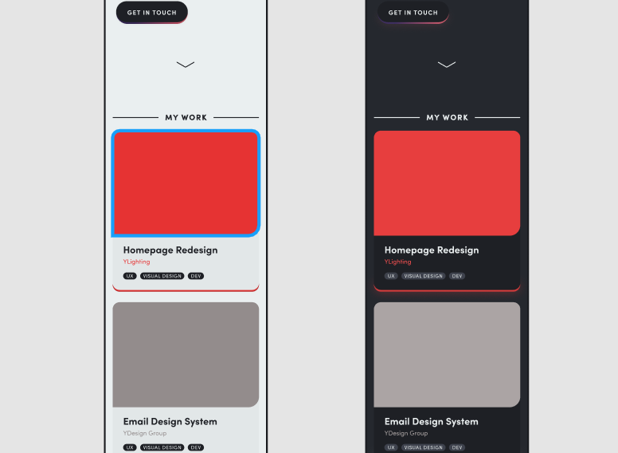

When the YDesign Group design team and I set out to redesign the YLighting.com homepage, we had a few goals in mind. First, we wanted to deliver a more engaging homepage experience for our users across mobile and desktop. Second, we wanted to create a design system with standardized and reusable components that we could use site-wide. Finally, this new system needed to be easy to use. Designers and marketing planners needed to be able to pull components off the shelf and use them in production with confidence.

## Wireframes

One thing I knew I wanted to do with this redesign was take advantage of the additional real estate larger screens afforded me. By expanding outside of YLighting's typical page-width, I hoped to showcase the fantastic imagery we often had at our disposal while making room for more editorial content.

One thing I knew I wanted to do with this redesign was take advantage of the additional real estate larger screens afforded me. By expanding outside of YLighting's typical page-width, I hoped to showcase the fantastic imagery we often had at our disposal while making room for more editorial content.

## Hi-Fidelity Mockups

After several iterations, we landed on a more open feel, relying on layout and spacing to create a hierarchy and rhythm. Former iterations of the homepage relied on boxes and borders to separate ideas. I felt that minimizing visual noise made for a design that was easier to digest at a glance, and felt like it was meant to be consumed as one cohesive piece.

- This is my first item
- And now a second item
- Maybe a third item

Achieving a homepage system that can feel uniquely crafted, while also being much easier to produce and plan week to week, was a big a challenge. In the end, I think we came away with a design foundation that achieved our visual goals and can be easily expanded over time.

## Development

In addition to being responsible for all of the design in this project, I also completed all of the necessary development work to move the new system into production. To summarize the technologies employed, the template was created as a series of interchangeable components (primary, two-wide, text block, category navigation, etc.) using BEM (Block Element Modifier) to organize the CSS. All CSS was pre-processed using Scss, autoprefixed and compressed using Grunt, and version controlled using Git.

Because the system is built using components, any homepage element can be used on its own anywhere else on the site. This includes a custom flex-box grid, type system, and spacing system.

## Results

Initially, I published this new homepage design as part of an A/B test, running alongside the old template with the same promotions and content. Once I verified that user engagement and revenue were comparable at minimum, I deployed the new template on its own.

### An Extra Headline

Comparing average homepage engagement (% of homepage visitors that engaged with a piece of homepage content) in the month preceding launch and the month after, we saw an average lift of 62%, with a 38% lift on mobile devices. While I'm unable to control for the differences in messaging during those time periods, those results are a great initial indicator. Even better, the modular nature of the homepage will allow for more rapid and detailed testing moving forward.
